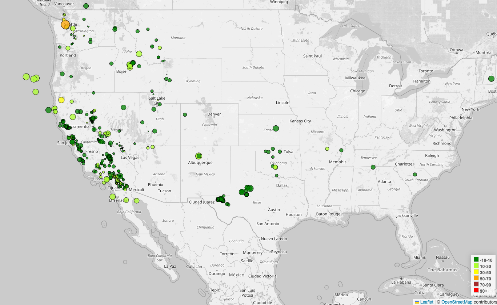

# leaflet-challenge
Module-15
Part-1

The JSON data from US geological Survey which presents earthquake information from last 7 days is being represented. 

The map shows the most recent data of last 7 days. The data is recieved in form of geoJson file live using the API from https://earthquake.usgs.gov/earthquakes/feed/v1.0/geojson.php. Which is further read using d3.

The circle radius represents the visual comparison between the magnitude between all the eathquakes.
The color represents the visual comparison between the depth of earthquakes.

